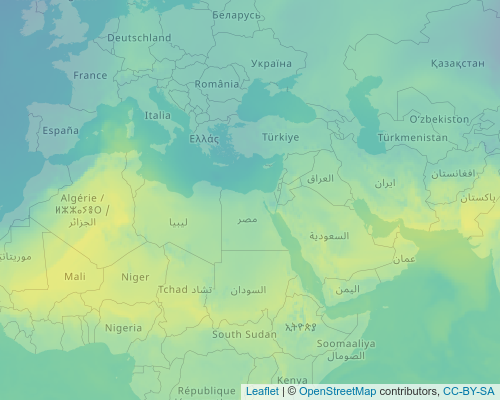

<!-- README.md is generated from README.Rmd. Please edit that file -->

# starsTileServer

<!-- badges: start -->

[](https://lifecycle.r-lib.org/articles/stages.html#experimental)
<!-- badges: end -->

The goal of starsTiles is to provide a simple way to add large data sets
in R to a leaflet application. Examples are available on the
[website](https://bartk.gitlab.io/starsTileServer/). Because it is
possible to provide functions pretty much any data that can be projected
can be visualized, for example composites or non square grids. This is
en example of using data from meteorological radar:


## Installation

You can install the development version as follows:

``` r
remotes::install_gitlab('bartk/starsTileServer')
```

## Example

This is a basic example which shows you how to solve a common problem:

``` r
library(starsTileServer)
```

Some example data can be downloaded as follows

``` r
require(ecmwfr)
request <-
  list(
    "dataset_short_name"  = "reanalysis-era5-pressure-levels",
    "product_type"  = "reanalysis",
    "variable"       = c("temperature", "geopotential", "u_component_of_wind", "v_component_of_wind"),
    "pressure_level" = c("875", "900", "925"),
    "year"           = "2000",
    "month"          = "04",
    "day"            = as.character(27:29),
    "time"           = sprintf("%02i:00", 0:23),
    "area"           = "64/-130/-64/144",
    "format"         = "netcdf",
    "target"         = "test.nc"
  )
# make sure you use your own uid and key ( https://cds.climate.copernicus.eu/#!/home )
wf_set_key("uid", "key", service = "cds")
ncfile <- wf_request(
  user = "uid",
  request = request,
  transfer = TRUE,
  path = "~",
  verbose = FALSE
)
```

### Setting up the server

The following commands would start a tile server

``` r
# note the process is ran in the background, do not forget to close it as it might use quite a bit of memory.
require(callr)
#> Loading required package: callr
rp <- r_bg(function() {
  # read a stars grid
  weatherData <- stars::read_stars("~/weatherData.nc", proxy = FALSE, sub = "t")
  names(weatherData) <- "t"
  sf::st_crs(weatherData) <- "+proj=longlat"
  colorFunction <- leaflet::colorNumeric("viridis", c(250, 310))
  colorFunctionWithAlpa <- function(x, alpha = 1) {
    paste0(colorFunction(x), as.character(as.raw(
      as.numeric(alpha) * 255
    )))
  }
  starsTileServer::starsTileServer$new(weatherData, colorFun = colorFunctionWithAlpa)$run(port = 3746)
})
```

### Visualizing the result

In a separate R session the data can be added to a leaflet map (in this
case temperature from the 900 mb level, at 2000-04-27 01:00:00)

``` r
require(leaflet)
#> Loading required package: leaflet
require(leaflet.extras)
#> Loading required package: leaflet.extras
map <- leaflet() %>%
  addTiles() %>%
  enableTileCaching() %>%
  addTiles(
    "http://127.0.0.1:3746/map/t/{z}/{x}/{y}?level=900&time=2000-04-27 01:00:00&alpha=0.5",
    options = tileOptions(useCache = TRUE, crossOrigin = TRUE)
  ) %>%
  setView(zoom = 3, lat = 30, lng = 30)
```

This map looks as follows:

``` r
map
```



The documentation of the api is available by appending url with
`__docs__` in this case: `http://127.0.0.1:3746/__docs__/`.

We have to make sure we close the server that is running as a separate
process:

``` r
message(rp$read_output())
#> t,
message(rp$read_error())
#> Running plumber API at http://127.0.0.1:3746
#> Running swagger Docs at http://127.0.0.1:3746/__docs__/
rp$finalize()
```

# Alternative mapping solutions

Several other solutions do exist for visualizing gridded data on leaflet
maps, for example `leafem::addStarsImage`, these do however differ in
two distinct ways. First they render static grids, therefore visualizing
times series of data or dynamically switching to a different
layer/dataset might be quite challenging. Second the `starsTileServer`
makes zooming in the map possible. For each zoom level the map is
dynamically rendered meaning it is possible to zoom in and out without
loosing any information.

Another package that can be used for visualizing gridded data in
`leaflet` is `tiler`. This package renders a static set of tiles. The
advantage is that no server needs to be running to use these tiles.
However the disadvantage is that all rendering needs to be done
beforehand. For large datasets this can require considerable resources
both for storage and calculation.

Dynamic rendering opens also possibilities to visualize other data
dynamically. The package allows for custom functions that render tiles.
These can be used to visualize derived attributes (e.g. wind speed or
uplift), data from other data sources (like databases) or non-regular
data (e.g. radar images).

Another big difference is that the data storage and the computer where
it is visualized do not have to be the same for a tile server. One tile
server can be used by many users. It is also possible to scale the
rendering resources by making the rendering process parallel.

# FAQ

-   What are `tiles`?

`Tiles` are the small images used by online maps to visualize the maps.
These are generally `256*256` pixels and generated on various zoom
level. More info can be found on
[wikipedia](https://en.wikipedia.org/wiki/Tiled_web_map).
